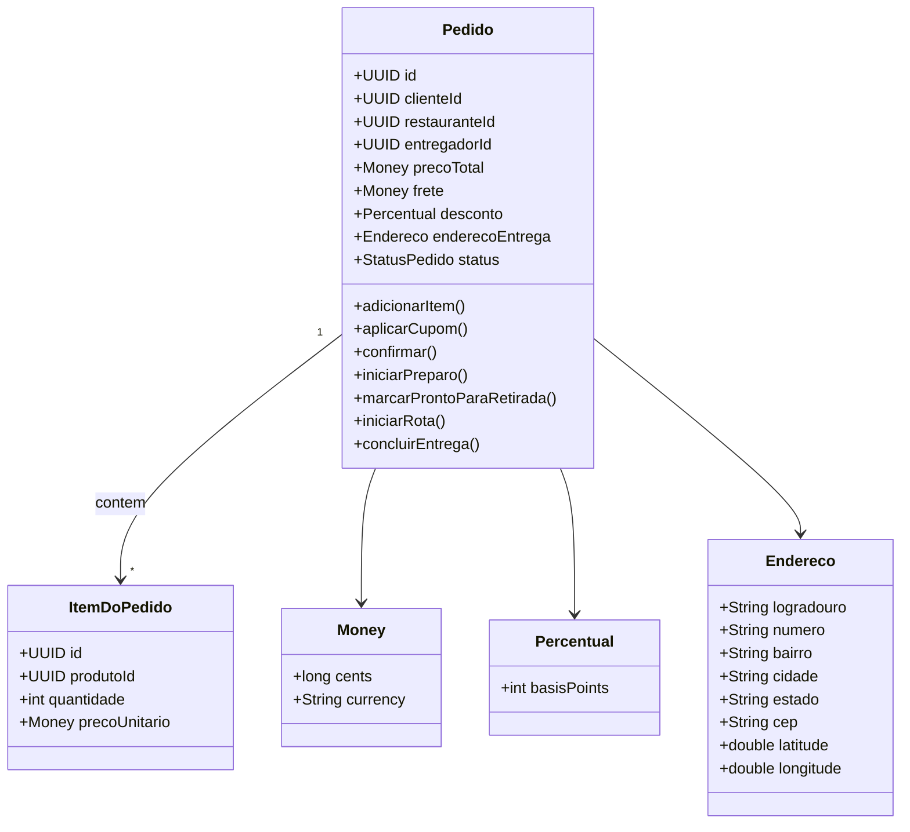

# 📚 SwiftEats Delivery — Design Tático (DDD3)

Este documento aplica o design tático do DDD ao domínio **SwiftEats Delivery**.

---

## 🩺 1) Sobre o Domínio Escolhido
**Nome do domínio:** SwiftEats Delivery  
**Objetivo do sistema:** Conectar clientes, restaurantes e entregadores com rapidez e confiabilidade, garantindo acompanhamento do pedido e previsão de chegada.  
**Principais atores:** Cliente, Restaurante, Entregador, Sistema de Pagamentos, Motor de Rotas, Operações (suporte/backoffice).  
**Contextos (Bounded Contexts):** Pedidos & Checkout, Roteirização & Entregadores, Precificação & Promoções, Catálogo, Pagamentos.

---

## 🧩 2) Entidades vs Value Objects

| Elemento              | Tipo (Entidade/VO) | Por quê? |
|------------------------|--------------------|----------|
| Pedido                | Entidade           | Tem identidade única e ciclo de vida. |
| ItemDoPedido          | Entidade           | Necessário para ajustes/cancelamentos individuais. |
| Cliente               | Entidade           | Identidade global (ClienteId). |
| Restaurante           | Entidade           | Identidade global (RestauranteId). |
| Entregador            | Entidade           | Identidade global (EntregadorId). |
| Endereco              | VO                 | Imutável; comparado por valor. |
| Email                 | VO                 | Validação e igualdade por valor. |
| Documento (CPF/CNPJ)  | VO                 | Tipagem semântica, imutável. |
| Money                 | VO                 | Moeda + valor; imutável; operações seguras. |
| Percentual            | VO                 | Usado para cupons/descontos; imutável. |
| PrevisaoDeChegada     | VO                 | Estimativa de tempo calculada; imutável. |
| Coordenada            | VO                 | Latitude/Longitude; imutável. |

---

## 🏗️ 3) Agregado Principal e Aggregate Root

**Agregado Principal:** Pedido  
**Aggregate Root (AR):** Pedido

**Conteúdo interno (consistência local):**
- Lista de itens (ItemDoPedido)
- EnderecoEntrega (VO)
- Status do pedido
- PrecoTotal (Money)
- Cupom (Percentual opcional)
- Frete (Money)

**Referências a outros agregados (por ID):**
- ClienteId  
- RestauranteId  
- EntregadorId (atribuído durante a rota)  
- PagamentoId (após confirmação)

**Boundary:**  
- Dentro: atributos e operações que exigem consistência imediata.  
- Fora: outros agregados apenas referenciados por ID.

**Operações de Domínio (exemplos):**
- adicionarItem(), removerItem(), aplicarCupom(), calcularTotal()  
- confirmar(), iniciarPreparo(), marcarProntoParaRetirada(), iniciarRota(entregadorId), concluirEntrega()

---

## 🧭 4) Invariantes e Máquina de Estados

**Invariantes:**  
- PrecoTotal = soma(Itens) + Frete - Desconto (≥ 0).  
- Cupom só pode ser aplicado se válido.  
- Mudança de estado deve seguir a ordem lógica.  
- Pedido só vai para EM_ROTA se tiver entregador atribuído.  
- Cancelamento só permitido até EM_PREPARO.  
- Endereço válido é obrigatório.  
- Operações críticas devem ser idempotentes.

**Máquina de Estados:**  
```
CRIADO -> CONFIRMADO -> EM_PREPARO -> PRONTO_PARA_RETIRADA -> EM_ROTA -> ENTREGUE
           \-> CANCELADO
EM_ROTA -> FALHA_ENTREGA -> (Reentrega ou Cancelamento)
```

---

## 🗃️ 5) Repositório

Exemplo em Java:
```java
public interface PedidoRepository {
    Optional<Pedido> obterPorId(UUID id);
    void adicionar(Pedido pedido);
    void salvar(Pedido pedido);
}
```

---

## 📣 6) Eventos de Domínio

| Evento              | Quando ocorre                | Payload mínimo                      | Tipo           |
|---------------------|------------------------------|-------------------------------------|----------------|
| PedidoConfirmado    | Após confirmar()             | pedidoId, total, clienteId          | Integração     |
| PagamentoEfetuado   | Após PSP autorizar pagamento | pedidoId, pagamentoId, valor        | Integração     |
| EntregadorAtribuido | Ao iniciarRota()             | pedidoId, entregadorId              | Interno        |
| PedidoEntregue      | Após concluirEntrega()       | pedidoId, timestamp                 | Integração     |

---

## 🗺️ 7) Diagrama (Mermaid)



---

## ✅ Checklist
- [x] VOs imutáveis e com igualdade por valor.  
- [x] Agregado com invariantes claras.  
- [x] Operações de domínio como métodos.  
- [x] Repositório focado na AR.  
- [x] Eventos com payload mínimo.
